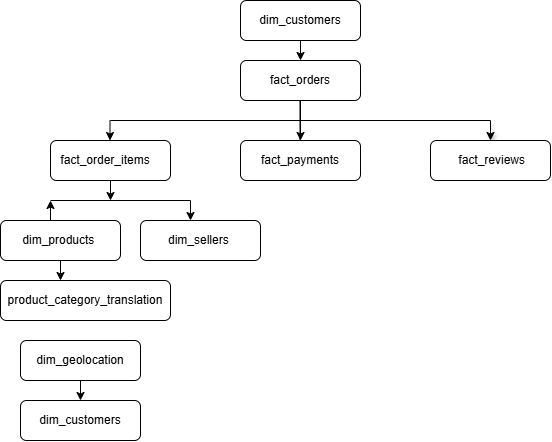

# 🛒 Olist E-commerce SQL Analysis

## Project Overview

This project presents an end-to-end business analysis of the Brazilian Olist E-commerce Marketplace using SQL, Excel, Power Query, and Power BI.

The project follows the complete data analytics workflow—from raw data preparation and validation to business understanding, exploratory data analysis, advanced SQL analysis, business insights, and interactive dashboard development.

The objective is to demonstrate practical SQL and business intelligence skills through a real-world e-commerce dataset.

---

# Project Objectives

- Build a relational database using MySQL
- Validate imported data before analysis
- Understand the business through key performance indicators (KPIs)
- Perform exploratory data analysis (EDA)
- Apply advanced SQL techniques for business analysis
- Generate meaningful business insights
- Develop an interactive Power BI dashboard
- Document the complete analytical workflow

---

# Business Problem

The Olist marketplace connects thousands of sellers and customers across Brazil.

The company wants to better understand:

- Customer purchasing behaviour
- Product performance
- Seller performance
- Revenue trends
- Order fulfilment
- Customer satisfaction
- Payment preferences

This project answers these business questions using SQL and data visualization.

---

# Dataset Information

**Dataset Name**

Brazilian E-commerce Public Dataset by Olist

**Source**

Kaggle

The dataset contains information about:

- Customers
- Orders
- Order Items
- Products
- Sellers
- Payments
- Reviews
- Geolocation
- Product Category Translation

---

# Tools & Technologies

- MySQL 8.0
- SQL
- Microsoft Excel
- Power Query
- Power BI
- Git
- GitHub

---

# Database Schema

The project follows a Star Schema consisting of Fact and Dimension tables.

### Dimension Tables

- dim_customers
- dim_products
- dim_sellers
- dim_geolocation
- product_category_translation

### Fact Tables

- fact_orders
- fact_order_items
- fact_payments
- fact_reviews

---

# Entity Relationship Diagram (ER Diagram)



---

# Project Workflow

```
Raw Dataset
      │
      ▼
Power Query Data Cleaning
      │
      ▼
CSV Export
      │
      ▼
MySQL Database
      │
      ▼
Data Validation
      │
      ▼
Business Understanding
      │
      ▼
Exploratory Data Analysis
      │
      ▼
Advanced SQL Analysis
      │
      ▼
Business Insights
      │
      ▼
Views & Stored Procedures
      │
      ▼
Power BI Dashboard
```

---

# Project Modules

## 01 Database Creation

- Created MySQL database
- Configured project environment

---

## 02 Table Creation

Created all dimension and fact tables with appropriate data types and primary keys.

---

## 03 Data Import

Imported cleaned CSV files into MySQL using `LOAD DATA INFILE`.

---

## 04 Data Validation

Performed comprehensive validation checks including:

- Row count verification
- Duplicate detection
- NULL value checks
- Date validation
- Primary key validation
- Review score validation
- Payment type validation
- Order status validation

### Sample Output


---

## 05 Business Understanding

Calculated key business KPIs including:

- Total Customers
- Total Orders
- Total Products
- Total Sellers
- Total Revenue
- Average Order Value
- Average Review Score
- Payment Methods
- Order Status
- Review Distribution

### Sample Output


---

## 06 Exploratory Data Analysis

Explored marketplace behaviour through SQL queries.

Topics covered:

- Monthly revenue
- Top-selling products
- Customer distribution
- Seller performance
- Revenue by state
- Freight analysis
- Payment behaviour
- Customer reviews

### Sample Output


---

## 07 Advanced SQL Analysis

Applied advanced SQL concepts including:

- Common Table Expressions (CTEs)
- Window Functions
- Ranking Functions
- CASE Statements
- Subqueries
- Aggregate Functions
- Views
- Joins

### Sample Output


---

## 08 Business Insights

Generated actionable insights related to:

- Revenue growth
- Customer behaviour
- Product performance
- Shipping performance
- Seller contribution
- Customer satisfaction

### Sample Output


---

## 09 Views & Stored Procedures

Created reusable database objects including:

Views

- Monthly Revenue
- Product Sales
- Customer Orders
- Seller Performance

Stored Procedures

- Customer Order Lookup
- Seller Revenue
- Product Sales

---

## 10 Power BI Dashboard

Developed an interactive dashboard to visualize marketplace performance.

### Dashboard Features

- KPI Cards
- Monthly Revenue Trend
- Top Customer States
- Product Category Revenue
- Review Score Distribution
- Interactive Filters

### Dashboard Preview


---

# Key Business Insights

Some major findings include:

- Revenue is concentrated among a small number of states.
- Five-star reviews account for the majority of customer feedback.
- Credit cards are the most frequently used payment method.
- Customer satisfaction remains generally high.
- Product sales vary significantly across product categories.
- A relatively small number of sellers contribute a large share of marketplace revenue.

---

# Repository Structure

```
Olist-Ecommerce-SQL-Analysis/

│
├── Dataset/
│
├── SQL/
│   ├── 01_Database_Creation.sql
│   ├── 02_Table_Creation.sql
│   ├── 03_Data_Import.sql
│   ├── 04_Data_Validation.sql
│   ├── 05_Business_Understanding.sql
│   ├── 06_Exploratory_Data_Analysis.sql
│   ├── 07_Advanced_SQL_Analysis.sql
│   ├── 08_Business_Insights.sql
│   ├── 09_Views_and_Stored_Procedures.sql
│   └── 10_PowerBI_Query.sql
│
├── Images/
│
├── Dashboard/
│
└── README.md
```

---

# Skills Demonstrated

- SQL
- Data Cleaning
- Data Validation
- Exploratory Data Analysis
- Business Analysis
- Window Functions
- Common Table Expressions
- Stored Procedures
- Views
- Data Visualization
- Power BI
- Dashboard Design
- Business Intelligence

---

# Future Improvements

- Build predictive sales forecasting models
- Develop customer segmentation analysis
- Create executive dashboards
- Add RFM customer analysis
- Automate SQL reporting

---

# Author

**Avushatha TN**

MBA | Aspiring Data Analyst | Business Analyst

GitHub: https://github.com/avushatha-da
